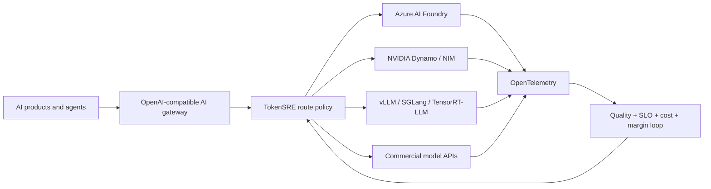

# Multi-Cloud AI Inference Platform

## LLM Inference Optimization, AI Gateway, Model Routing, NVIDIA Dynamo, NIM, vLLM, Kubernetes GPU Autoscaling, LLMOps, Observability and FinOps

**TokenSRE** is an open-source, provider-neutral decision plane for production LLM inference. It determines whether a route satisfies quality, latency, cost, capacity, availability and data-residency requirements, calculates its contribution margin, then produces a bounded canary recommendation and reproducible receipt.

[](https://github.com/AAH20/llm-inference-optimization-platform/actions/workflows/ci.yml)

> **Claim boundary:** the reference scenario is a deterministic synthetic evaluation. It does not call Azure Foundry, OpenRouter, NVIDIA NIM, vLLM, SGLang or TensorRT-LLM and does not claim physical GPU performance.

## Business problem: profitable, reliable AI inference

Every AI request creates a quality, latency, availability and margin decision. Teams overpay for simple workloads, under-provision difficult ones, react slowly to provider failures, waste GPU capacity, lose KV cache during rollouts and optimize token cost without knowing whether a customer workflow is profitable.

TokenSRE makes routing changes evaluated and reversible while answering the commercial question: **what does this successful customer task cost, earn and contribute?**

## Architecture



See [the production architecture and claim boundaries](docs/architecture.md).

## Executable multi-cloud model-routing case study

The first vertical slice evaluates **45 billion monthly tokens** across classification, RAG, code and reasoning workloads. It compares four configurable contracts:

- commercial frontier API;
- Azure Foundry model router;
- self-hosted NVIDIA NIM on Kubernetes GPU infrastructure;
- self-hosted vLLM experiencing a simulated health failure.

```bash
PYTHONPATH=src python3 -m tokensre.cli \
  examples/multi-cloud-model-routing/45b-tokens.json \
  --output generated/45b-token-routing

PYTHONPATH=src python3 -m unittest discover -s tests -v
```

The evaluator:

1. Rejects unhealthy providers.
2. Enforces workload quality thresholds.
3. Enforces p95 latency and peak-capacity targets.
4. Enforces data residency.
5. Selects the lowest-cost eligible backend.
6. Attributes revenue, inference cost and contribution margin per workflow.
7. Calculates token and self-hosted GPU economics.
8. Blocks autonomous production execution.
9. Emits a deterministic SHA-256 receipt.

The configured case study models **$6.01M monthly revenue**. This is a scenario input, not realized A2Z SOC revenue. The generated scorecard shows baseline and candidate contribution margins, route-level cost and the assumptions behind every figure.

## OpenAI-compatible decision API

Run the bounded route-decision API locally:

```bash
PYTHONPATH=src python3 -m tokensre.gateway \
  examples/multi-cloud-model-routing/45b-tokens.json

curl -s http://127.0.0.1:8080/v1/route \
  -H 'content-type: application/json' \
  -d '{"workload":"rag"}'
```

The response contains a selected backend, workload economics, evidence receipt and `auto_execute: false`. Streaming proxying, provider authentication and live traffic execution are not claimed.

## NVIDIA Dynamo, NIM, vLLM, TensorRT-LLM and SGLang

The current model includes health-aware NVIDIA NIM and vLLM backend contracts. Live adapters remain roadmap work and will preserve engine version, model profile, GPU type and raw benchmark receipts rather than claiming synthetic GPU results.

## Azure AI Foundry and multi-cloud model routing

The Azure Foundry profile participates in the same production envelope as self-hosted and commercial APIs. Future adapters will add Azure Foundry, OpenRouter and direct-provider evaluation without coupling policy to a single vendor.

## Kubernetes GPU autoscaling

The included Kubernetes HPA demonstrates bounded autoscaling structure with stabilization. Its container is deliberately a CPU-only placeholder. Queue depth, tokens per second, KV-cache pressure, MIG placement and GPU telemetry adapters remain explicit roadmap items.

## LLM observability and LLMOps

Evaluation receipts capture routes, health, quality, latency, cost, capacity, residency, promotion status and evidence hashes. The Azure Bicep module creates a low-cost observability and receipt-storage plane using Log Analytics, Application Insights and private Blob Storage.

## AI FinOps and inference unit economics

The 45-billion-token scenario compares a baseline blended cost against the eligible candidate routes. It separately models eight self-hosted GPUs at `$3.50/GPU-hour`, moving from 35% to 65% useful utilization.

All figures are configurable scenario inputs—not Azure, NVIDIA or provider quotations and not guaranteed cash savings. Capacity-efficiency improvement may create deferred purchases or additional sellable capacity rather than immediate cash reduction.

## Infrastructure as Code and policy-controlled promotion

The repository includes:

- compilable Azure Bicep;
- Kubernetes autoscaling example;
- OpenAI-compatible request contract;
- deterministic promotion policy;
- GitHub Actions regression evaluation;
- generated scorecards and promotion receipts.

## Repository map

```text
src/tokensre/                         deterministic routing evaluator
examples/multi-cloud-model-routing/  45B-token synthetic workload
contracts/                            OpenAI-compatible routing schema
kubernetes/                           hardened decision API and autoscaling contracts
infra/azure/                          observability and evidence plane
policy/                               production-promotion gates
generated/                            scorecards and receipts
docs/                                 search evidence and evaluation loop
tests/                                behavioral guarantees
```

## Reproduce the evidence

```bash
PYTHONPATH=src python3 -m unittest discover -s tests -v
PYTHONPATH=src python3 -m tokensre.cli \
  examples/multi-cloud-model-routing/45b-tokens.json \
  --output generated/45b-token-routing
```

Current verified baseline: **13 tests**, deterministic receipt `bf5e5bb9a5cac29768ad403b48553c736f01476defa65895a279693e4e075c4a`.

See the [search and ATS evidence map](docs/search-and-ats-evidence.md) and [continuous evaluation loop](docs/evaluation-loop.md).

## Roadmap

- OpenAI-compatible authenticated streaming proxy
- Live Azure Foundry and OpenRouter adapters
- NVIDIA NIM, vLLM, TensorRT-LLM, SGLang and Dynamo adapters
- OpenTelemetry semantic conventions and Prometheus dashboards
- KEDA token-queue and KV-cache autoscaling
- Model-download and cache-placement optimization
- Provider outage and quota-exhaustion fault injection
- RAG, code, agent and tool-call evaluation datasets
- Multi-region, multi-cloud and sovereign failover
- Live billing export and customer-SLA ledger

## Work with A2Z SOC

Operating or designing production GenAI? **[Request an LLM Inference Cost, Reliability and Performance Assessment](https://a2zsoc.com)** covering model routing, NVIDIA NIM/vLLM, Azure, Kubernetes GPU capacity, observability, quality evaluation and AI unit economics.
