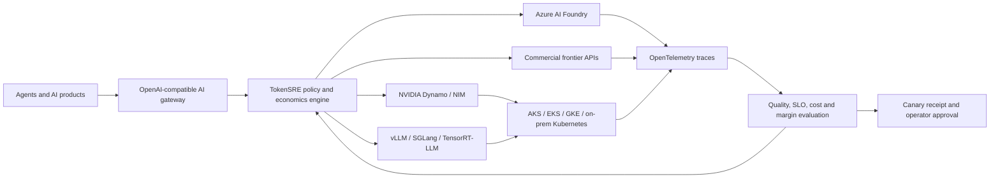

# Production architecture

## Control-plane boundary

TokenSRE exposes an authenticated OpenAI-compatible gateway. It proxies buffered or SSE streaming requests to configured upstreams, carries correlation and evidence-receipt headers, and fails over on transport errors, HTTP 429 and upstream 5xx responses. A per-backend circuit breaker prevents repeated traffic to a failing service. Prometheus exports request, latency and failover metrics.

The deterministic evaluator remains deliberately separate from live traffic. Synthetic quality, price and performance inputs may choose candidate ordering, but they never constitute physical benchmark evidence. Production operators must replace those values with signed evaluation and billing records.

## Production invariants

1. An unhealthy or ineligible backend cannot be selected.
2. Quality, latency, capacity and data residency are hard constraints.
3. Cost is optimized only inside that production envelope.
4. Missing request economics fails validation.
5. Every report is deterministic for the same canonical scenario.
6. A recommendation cannot mutate policy or promote itself to production.
7. Production mode fails closed when gateway authentication is absent.
8. Secrets enter through environment-backed Kubernetes Secrets; they are never stored in scenarios or receipts.

## Multi-cloud deployment paths

- **Azure:** Foundry hosted models or agents, AKS GPU pools, Azure Monitor and Application Insights.
- **AWS:** EKS GPU pools or managed provider endpoints behind the same route contract.
- **Google Cloud:** GKE GPU pools or managed provider endpoints behind the same route contract.
- **On premises / sovereign:** Kubernetes-hosted NIM, Dynamo, vLLM or compatible engines with explicit residency tags.

All OpenAI-compatible endpoints can use the live adapter. Provider-specific authentication shapes, model catalogs and non-OpenAI protocols require dedicated adapters. No Azure, NVIDIA or commercial endpoint is provisioned or benchmarked by the repository itself.
