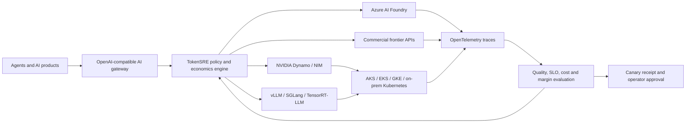

# Production architecture

## Control-plane boundary

TokenSRE recommends a bounded route; it does not impersonate an inference provider. The current API returns a route and deterministic receipt with `auto_execute: false`. Provider credentials, streaming proxy behavior, retries, circuit breakers and live telemetry exporters remain explicit integration work.

## Production invariants

1. An unhealthy or ineligible backend cannot be selected.
2. Quality, latency, capacity and data residency are hard constraints.
3. Cost is optimized only inside that production envelope.
4. Missing request economics fails validation.
5. Every report is deterministic for the same canonical scenario.
6. A recommendation cannot promote itself to production.

## Multi-cloud deployment paths

- **Azure:** Foundry hosted models or agents, AKS GPU pools, Azure Monitor and Application Insights.
- **AWS:** EKS GPU pools or managed provider endpoints behind the same route contract.
- **Google Cloud:** GKE GPU pools or managed provider endpoints behind the same route contract.
- **On premises / sovereign:** Kubernetes-hosted NIM, Dynamo, vLLM or compatible engines with explicit residency tags.

These are architectural interfaces. Only the deterministic local evaluator and decision API are implemented in this release.
